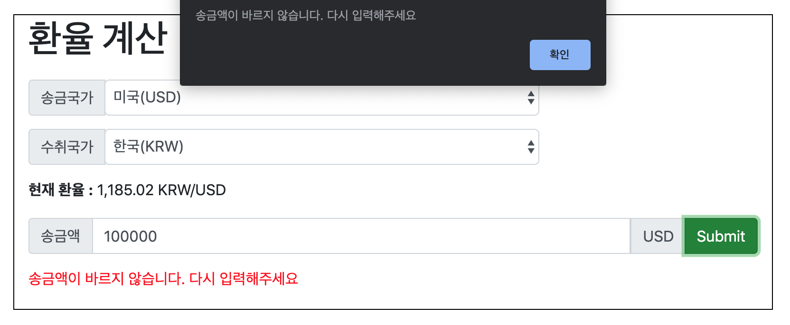

환율 계산기
---

사용 기술 

Java, Springboot, Thymeleaf

---

구동 방법
~~~
git clone https://github.com/kim-daeyong/ex-rate-calculator.git
cd ex-rate-calculator
mvn package
java -jar target\ex-rate-calculator-0.0.1-SNAPSHOT.jar
http://localhost:8000/ 접속

~~~

---

설계

1. 환율정보는 변동의 폭은 작지만 정확하게 요구되고 생각보다 자주 바뀌기에 매 요청 시마다 데이터를 가져오도록 했습니다. 

2. 환율 정보는 Free Plan에 따라 1시간에 한번씩 스케쥴러를 통해 갱신되도록 했습니다.

3. API 키의 경우 민감한 문제가 될 수 있기에 APIKey.properties를 따로 만들어주어 key정보를 담아주었습니다.
    (이 프로젝트의 경우 확인이 용이하게 올려두었습니다.)

4. API에선 호출만 담당하고 계산 및 변환등은 Service에서 담당하도록 했습니다.

5. API 호출과 계산 클래스를 따로 두어 API 변동에 용이하도록 하였습니다.

---

시연 사진

---